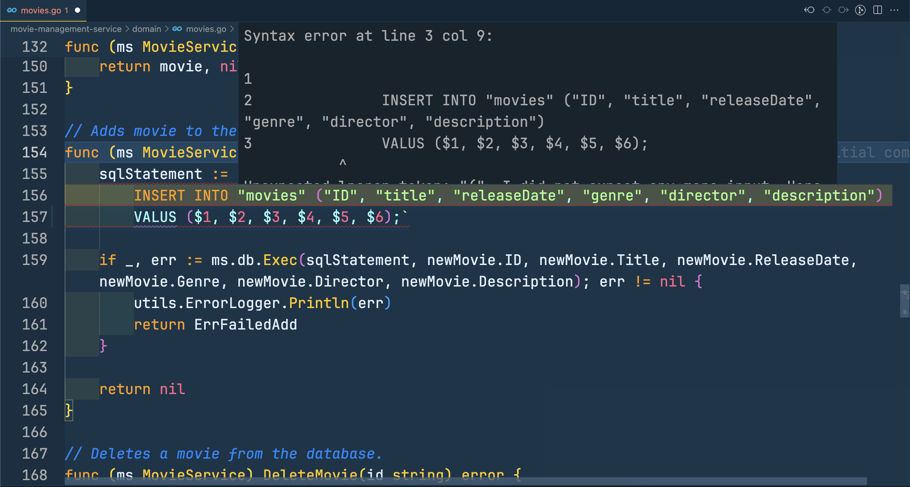
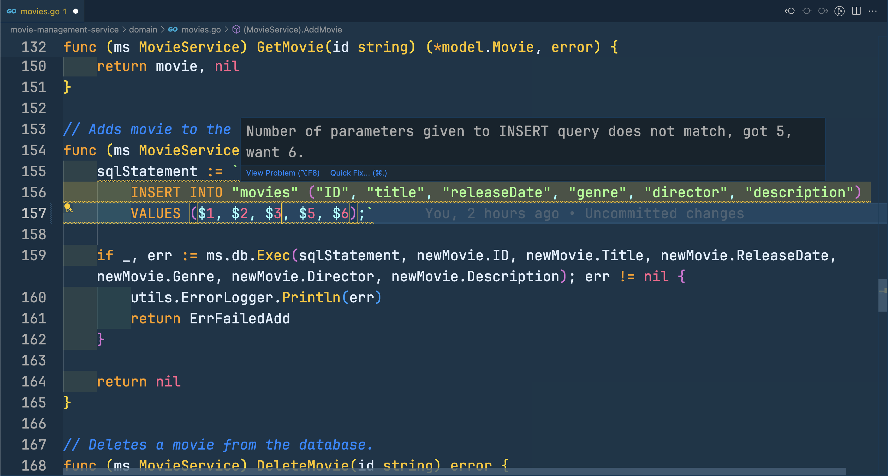
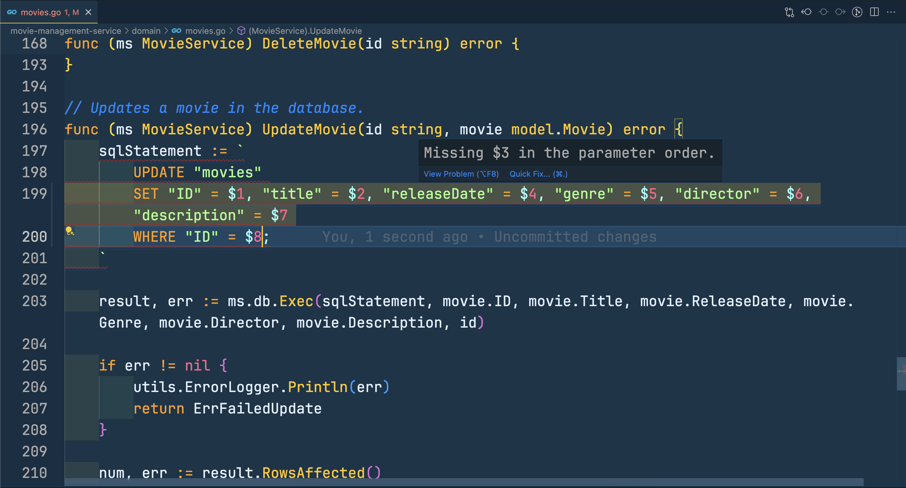

# lint-inline-sql-in-go README

lint-inline-sql-in-go helps you lint inline Postgres SQL statements in your golang code.

## Features

### Catch syntax errors in your inline SQL



### Warns when number of parameters does not match in a INSERT query



### Catch missing parameters in order



## Requirements

The extension uses and wouldn't be possible without [pgsql-ast-parser](https://github.com/oguimbal/pgsql-ast-parser). No set up required from user's end.

## Extension Settings

This extension contributes the following settings:

- `lintInlineSQLInGo.sqlRegex`: To match sql statements in your code. Defaults to "\`([^\`]\*)\`" ie it matches all tilde quoted strings.

For example, to match only tilde quoted strings which are assigned to a `sql` variable you can do something like -

```json
  "lintInlineSQLInGo.sqlRegex": "sql := `([^`]*)`"
```

## Known Issues

No known issues. But syntax errors can be improved from default error messages that we get from parser.

## Release Notes

### 0.0.2

- Fix screenshots in README

### 0.0.1

Initial release.
